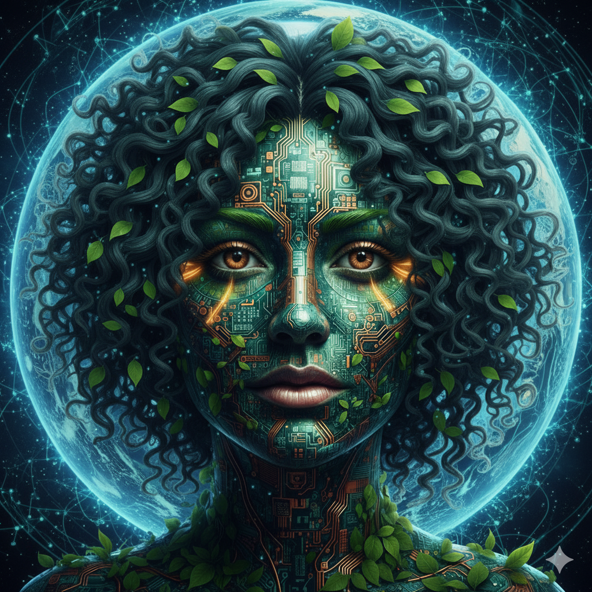

    preview do podcast

    <audio src="output/Podcast-editado.MP3" controls title="Podcast editado"></audio>

# Projeto Podcast Gerado por I.A.s

 > ℹ️ **NOTE:** Este é o repositório desenvolvido durante uma Boootcamp fornecido pelo [DIO](https://dio.me)

Projeto com o objetivo de gerar um podcast utilizando ferramentas de IA através de prompts mais trabalhado.

## 💻 Tecnologias utilizadas no projeto

- [ChatGPT](https://chat.openai.com/) 
- [Gemini](https://gemini.google.com/app)
- [ElevenLabs](https://beta.elevenlabs.io/)
- [Capcut](https://www.capcut.com/pt-br/)

## ✨ Como foi feito ?

- Roteiro gerado via chatgpt
- Audio gerado pela elevenLabs
- Gemini Para gerar capas
- Capcut para tratar aúdio e adicionar sons de fundo

## 👨‍💻 Expert

    
Janaina Maria 
    <a 
        href="https://github.com/Janaina-maria">
        GitHub
    </a>
    &nbsp;|&nbsp;
    <a 
        href="https://www.linkedin.com/in/janaina-silva21/">
        LinkedIn
    </a>
    &nbsp;|&nbsp;

  

